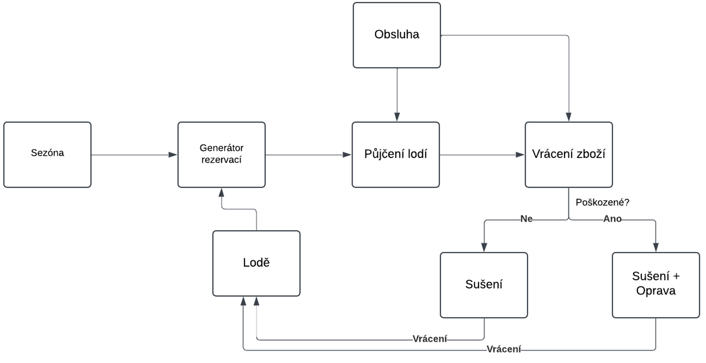
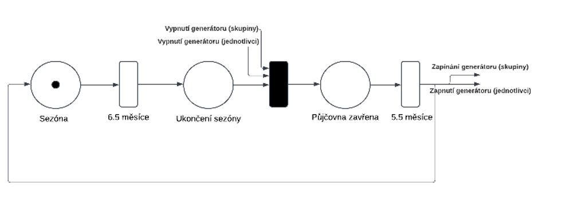
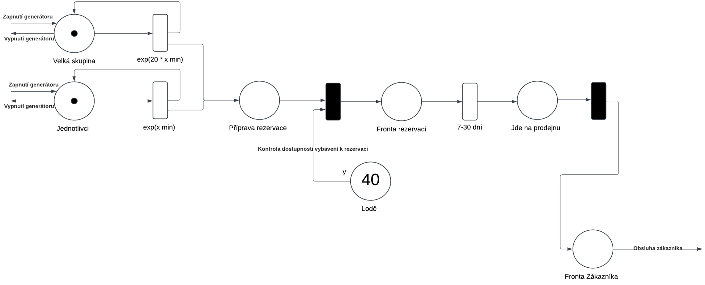
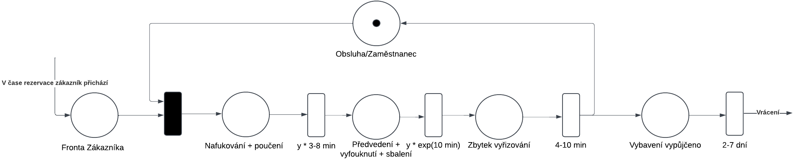
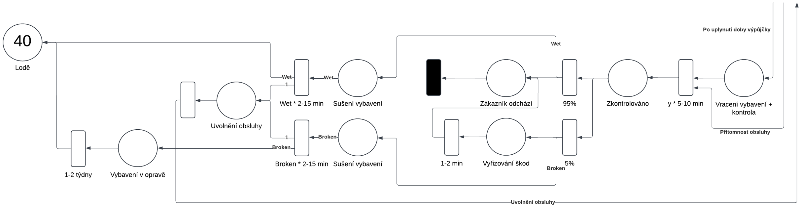

# Modelování a simulace
Tento projekt implementuje model půjčovny vodáckého vybavení SportRonTour a zkoumá chování simulovaného systému. Simulace je zaměřená na aktivní sezónu (od poloviny dubna do konce října) a snaží se co nejvěrněji napodobit přísun zákazníků, včetně velkých skupin (zájezdy).

Na základě experimentů lze určit:
- ideální počet lodí,
- odolnost systému vůči nárazovým špičkám (reklamní kampaň),
- další klíčové faktory ovlivňující efektivitu půjčovny.

## Autoři
**Autoři:** Tomáš Barták a Norman Babiak  

## Ověření validity modelu
Validita modelu byla ověřena jednoduchými experimenty, jejichž výsledky byly porovnány s reálnými provozními daty a zpětnou vazbou od půjčovny.

# Rozbor tématu, použitých metod a technologií
Model vychází z analýzy reálných procesů půjčovny:  
- **Rezervace** předem domluvených termínů  
- **Fronty** a FIFO obsluha zákazníků  
- **Kontrola** a možná oprava či výměna poškozených lodí (5 % případů)  

## Použité metody a technologie
- Popis systému formou **Petriho sítě**
- Implementace v **C++** se simulační knihovnou **SIMLIB** 
- Sestavení pomocí **GNUMake** a kompilátoru **g++**

## Původ použitých technologií
- **SIMLIB** (GNU LGPL) – Petr Peringer, David Leska, David Martinek  
- **Git** a **GitHub** pro verzování a správu kódu

# Koncepce

## Abstraktní model
Model je složen ze čtyř hlavních bloků:
1. **Sezónní dostupnost** – zapínání/vypínání generátorů rezervací v průběhu roku  
2. **Generátor zákazníků/rezervací** – kontrola dostupnosti a plánování termínu  
3. **Obsluha zákazníka** – nafouknutí, demonstrace, podepsání smlouvy, půjčení  
4. **Vrácení zboží** – kontrola stavu, sušení, oprava/lodní sklad

### Sezónní dostupnost
- Aktivní sezóna trvá **6,5 měsíce** (duben–říjen).  
- Po uplynutí se generátory vypnou na **5,5 měsíce**, než sezóna znovu začne.

### Generátor zákazníků/rezervací
- Kontrola, zda je požadovaný počet lodí k dispozici.  
- Naplánování rezervace na volné termíny.  
- Pokud termín není dostupný, hledá se nejbližší volná doba.

### Obsluha zákazníka
- **FIFO** fronta čekajících  
- Nafouknutí, poučení, předvedení, vyfouknutí a sbalení  
- Podpis smlouvy, úhrada poplatků

### Vrácení zboží
1. Kontrola stavu (5 % poškození)  
2. Usušení nepoškozených lodí  
3. Doplatek a oprava poškozených lodí  
4. Navrácení do skladu

